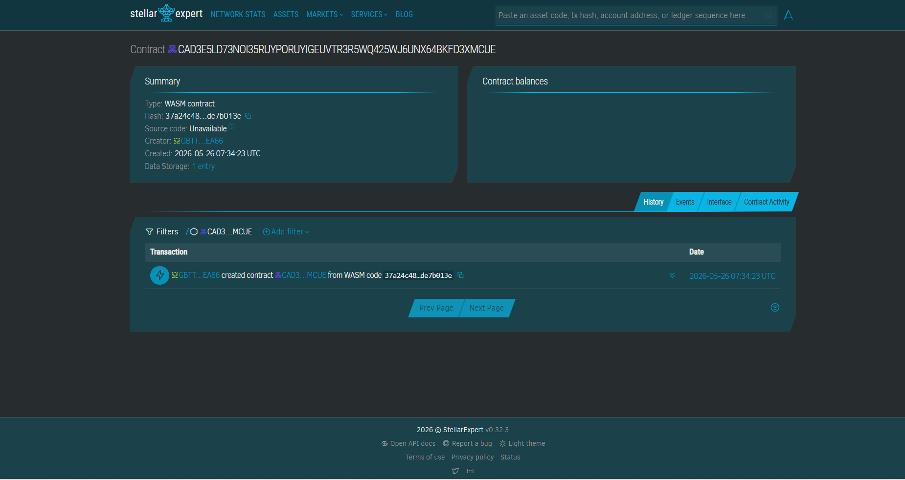

# FloodFund QR

Transparent typhoon relief payouts using Stellar and Soroban.

# CONTRACT ID
CAD3E5LD73NOI35RUYPORUYIGEUVTR3R5WQ425WJ6UNX64BKFD3XMCUE

# CONTRACT LINK
https://stellar.expert/explorer/testnet/contract/CAD3E5LD73NOI35RUYPORUYIGEUVTR3R5WQ425WJ6UNX64BKFD3XMCUE



---

## Problem

Manual cash aid distribution during typhoons causes payout delays, missing recipients, and lack of transparency.

## Solution

FloodFund QR enables instant on-chain donations and transparent emergency payouts using Stellar wallets and Soroban smart contracts.

---

## Timeline

Week 1
- Smart contract setup
- Wallet integration

Week 2
- QR donation flow
- Recipient approval dashboard

Week 3
- Testing
- Testnet deployment
- Demo preparation

---

## Stellar Features Used

- XLM / USDC transfers
- Soroban smart contracts
- Trustlines

---

## Vision and Purpose

Provide transparent and fast disaster relief distribution during Philippine typhoons.

---

## Prerequisites

- Rust stable
- Soroban CLI

Check installation:

```bash
soroban --version
